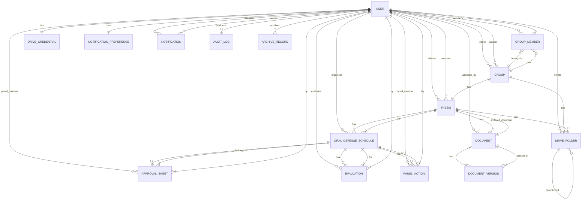

# Database Relationships Visualization

```mermaid
erDiagram
    USER ||--o{ GROUP_MEMBER : "members"
    USER ||--o{ GROUP : "leader"
    USER ||--o{ GROUP : "adviser"
    USER ||--o{ THESIS : "adviser"
    USER ||--o{ THESIS : "proposer"
    USER ||--o{ DOCUMENT : "uploaded_by"
    USER ||--o{ ORAL_DEFENSE_SCHEDULE : "organizer"
    USER ||--o{ APPROVAL_SHEET : "panel_member"
    USER ||--o{ EVALUATION : "evaluator"
    USER ||--o{ PANEL_ACTION : "panel_member"
    USER ||--|| DRIVE_CREDENTIAL : "has"
    USER ||--o{ DRIVE_FOLDER : "owner"
    USER ||--|| NOTIFICATION_PREFERENCE : "has"
    USER ||--o{ NOTIFICATION : "recipient"
    USER ||--o{ NOTIFICATION : "sender"
    USER ||--o{ AUDIT_LOG : "performs"
    USER ||--o{ ARCHIVE_RECORD : "archives"

    GROUP ||--|| THESIS : "has"
    GROUP ||--o{ GROUP_MEMBER : "has"
    GROUP ||--o{ DRIVE_FOLDER : "has"

    GROUP_MEMBER }|--|| GROUP : "belongs to"
    GROUP_MEMBER }|--|| USER : "is"

    THESIS ||--o{ DOCUMENT : "has"
    THESIS ||--o{ ORAL_DEFENSE_SCHEDULE : "has"
    THESIS ||--|| DOCUMENT : "archived_document"
    THESIS ||--o{ DRIVE_FOLDER : "has"

    DOCUMENT ||--o{ DOCUMENT_VERSION : "has"

    DOCUMENT_VERSION }|--|| DOCUMENT : "version of"

    ORAL_DEFENSE_SCHEDULE ||--o{ APPROVAL_SHEET : "has"
    ORAL_DEFENSE_SCHEDULE ||--o{ EVALUATION : "has"
    ORAL_DEFENSE_SCHEDULE ||--o{ PANEL_ACTION : "has"
    ORAL_DEFENSE_SCHEDULE }|--|| THESIS : "for"

    APPROVAL_SHEET }|--|| ORAL_DEFENSE_SCHEDULE : "belongs to"
    APPROVAL_SHEET }|--|| USER : "by"

    EVALUATION }|--|| ORAL_DEFENSE_SCHEDULE : "for"
    EVALUATION }|--|| USER : "by"

    PANEL_ACTION }|--|| ORAL_DEFENSE_SCHEDULE : "for"
    PANEL_ACTION }|--|| USER : "by"

    DRIVE_FOLDER ||--o{ DRIVE_FOLDER : "parent-child"
```